# DevLog

Yazılımcılar için tasarlanmış bir **blog ve içerik platformu**. Kullanıcılar keşfet sayfasından yazıları gezebilir, kayıt olup giriş yapabilir; **yazar** olarak blog ekleyebilir, **yönetici** ise kategori, onay ve yazarlık talepleri gibi işlemleri ayrı yönetim ekranlarından yürütür. Arayüz **JSF (Facelets)** ve **Bootstrap 5** ile sunulur.

---

## Kullanılan teknolojiler

| Alan | Teknoloji |
|------|-----------|
| Dil ve derleme | Java 21, Maven (`DevLog.war`) |
| Sunucu tarafı | Jakarta EE 10 (JSF, CDI, EJB, JPA) |
| Kalıcılık | EclipseLink JPA, **PostgreSQL** |
| Güvenlik | Jakarta Security Enterprise (ör. şifre hash) |
| Ön yüz | Facelets (XHTML), Bootstrap 5, proje CSS’i |
| Çalıştırma | Eclipse GlassFish veya Jakarta EE 10 uyumlu uygulama sunucusu |

---

## Uygulamadan ekran görüntüleri

### Giriş ve kayıt

  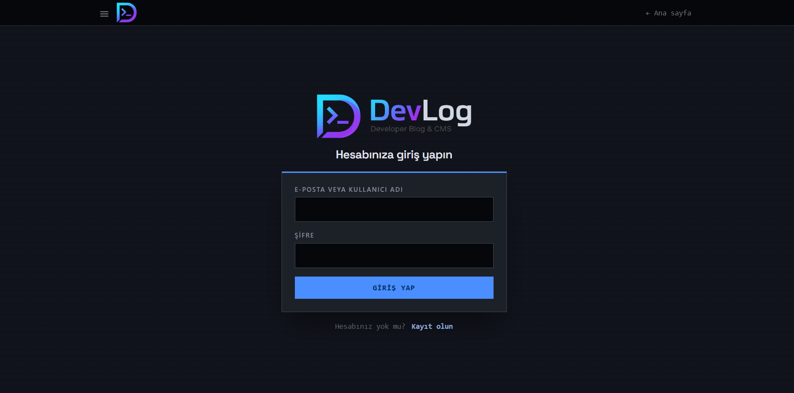
  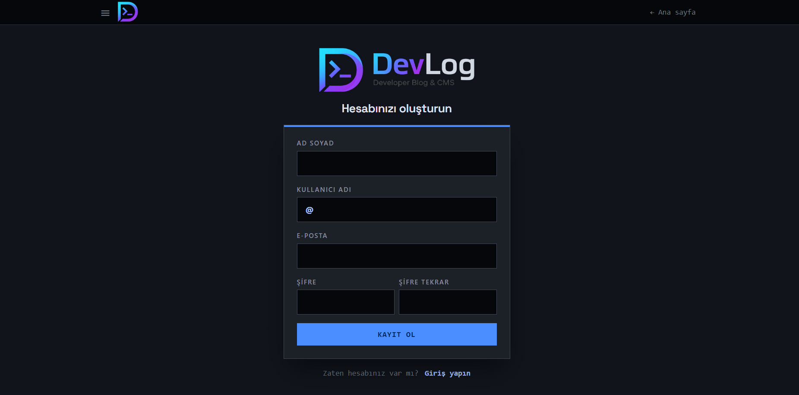

### Blog detay

  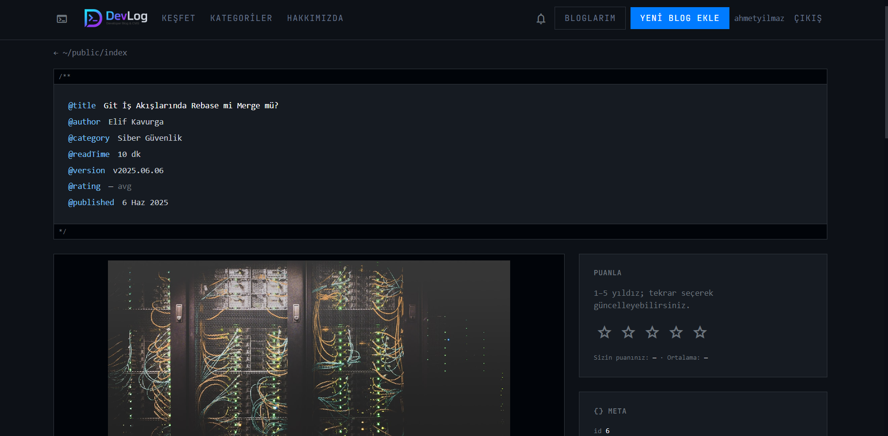
  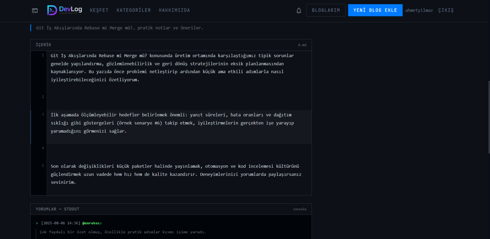

### Admin özellikleri

  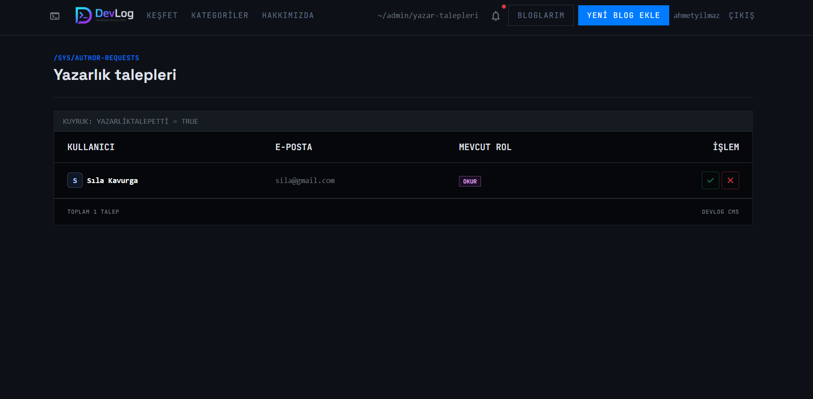
  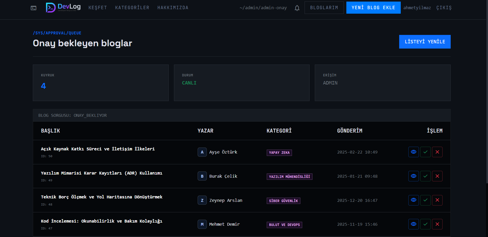
  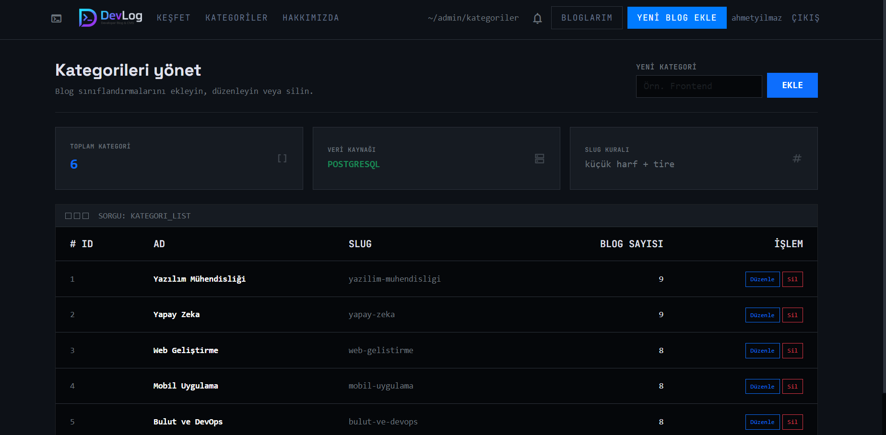

### Keşfet, panel ve diğer ekranlar

  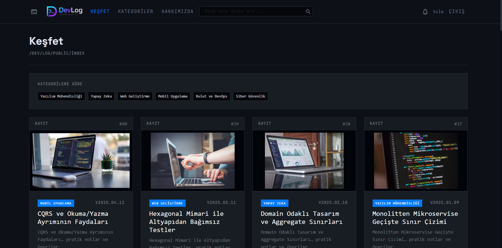
  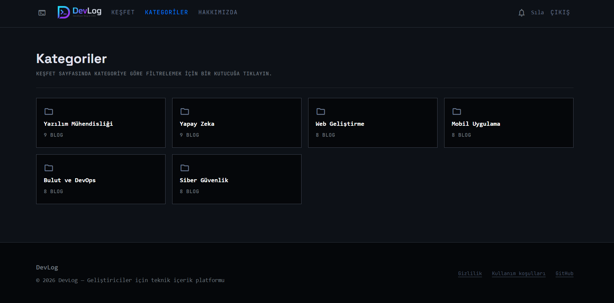

  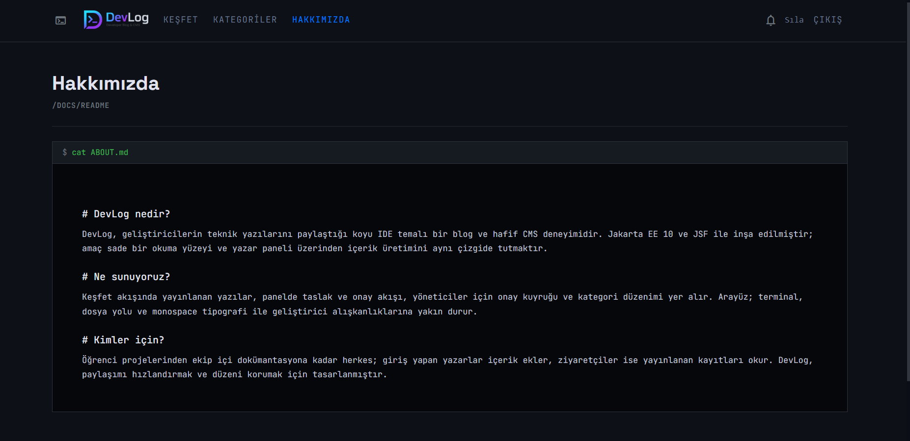
  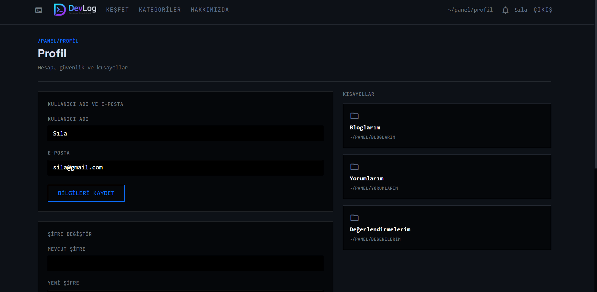

  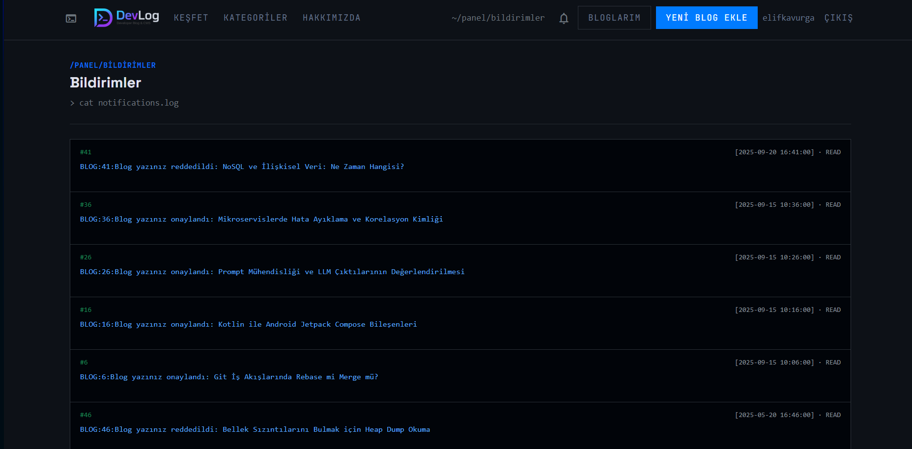
  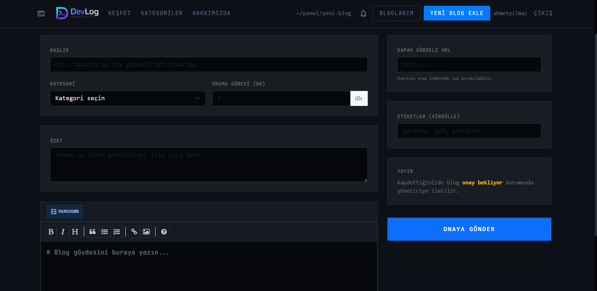

  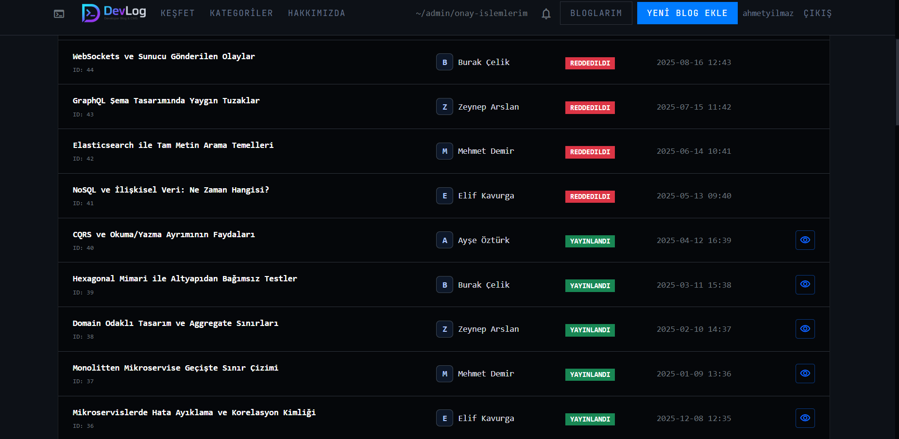

---

## Nasıl çalıştırılır?

1. **Ön koşullar:** JDK 21, Maven, PostgreSQL ve Jakarta EE 10 destekli bir sunucu (ör. Eclipse GlassFish 7+).
2. **Veritabanı:** PostgreSQL’de uygulamanın bağlanacağı veritabanını oluşturun. Bağlantı bilgileri `src/main/webapp/WEB-INF/glassfish-resources.xml` içindeki havuz ayarlarıyla uyumlu olmalı; kendi ortamınıza göre sunucu adı, port, veritabanı adı ve kullanıcıyı güncelleyin. JNDI adı `java:app/jdbc/DevLogDS` olmalıdır (`src/main/resources/META-INF/persistence.xml` ile eşleşir).
3. **Paket:** Proje kökünde `mvn clean package` → çıktı `target/DevLog.war`.
4. **Dağıtım:** `DevLog.war` dosyasını sunucuya deploy edin; kaynak tanımları (`glassfish-resources.xml`) sunucuya işlendiyse veri kaynağı otomatik oluşur.
5. **İlk açılış:** Uygulamayı en az bir kez çalıştırıp JPA’nın tabloları oluşturduğundan emin olun; ardından örnek veri yükleyebilirsiniz.

**Klasör özeti:** Java kaynakları `src/main/java/` (`entity`, `facade`, `bean` alt paketleriyle), web sayfaları ve varlıklar `src/main/webapp/`, JPA/CDI meta `src/main/resources/META-INF/`.

### Kullanıcı rolleri

- **OKUR:** Genel okuma, yorum vb. (yetkiye bağlı ekranlar).
- **YAZAR:** Blog ekleme ve kendi içerik akışı.
- **ADMIN:** Onay kuyruğu, kategori yönetimi, yazarlık talepleri gibi yönetim ekranları.

### Örnek veriler (görmek ve test etmek için)

`demo-veriler/` altında PostgreSQL için hazır SQL dosyaları vardır. **Sıra, ön koşullar ve hata durumunda ne yapılacağı** tek yerde anlatılmıştır: **`demo-veriler/CALISTIRMA-SIRASI.txt`**. Özet: önce uygulamayı açıp tabloların oluşmasını sağlayın, ardından dosyaları belirtilen sırada çalıştırın; en sonda `06-demo-sequence-sifirlama.sql` gelir. Demo kullanıcıların ortak şifresi ve hash açıklaması `01-demo-kullanicilar.sql` dosyasının üst yorumlarında yer alır.
